# Starbucks Web Application 개발 프로젝트

> MVT 기반의 python Framework Django를 활용한 스타벅스 웹 주문 시스템을 구축한다.

## 프로젝트 배경

#### 프로젝트 개요

- 컨셉 : 스타벅스 어플리케이션에 있는 주요 기능인 주문시스템(Siren Order)을 기반으로web application server를 구축
- 개발 환경 : Pycharm

* Back-end : git, python, Django, crwaling
* Front-end : HTML, jQuery, javascript, bootstrap

#### 전체 프로젝트 구성

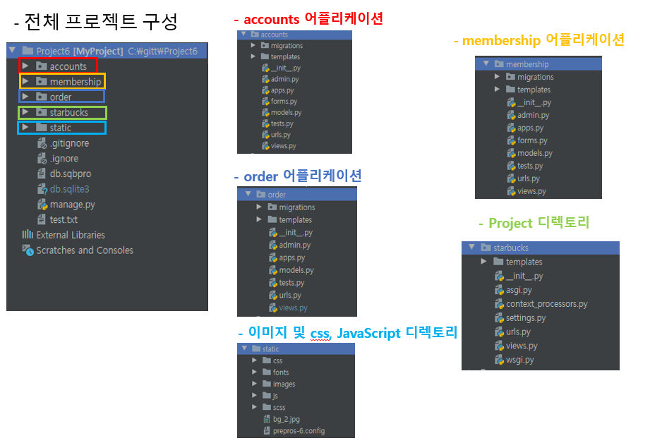

## 수행결과

#### 데이터베이스 구성

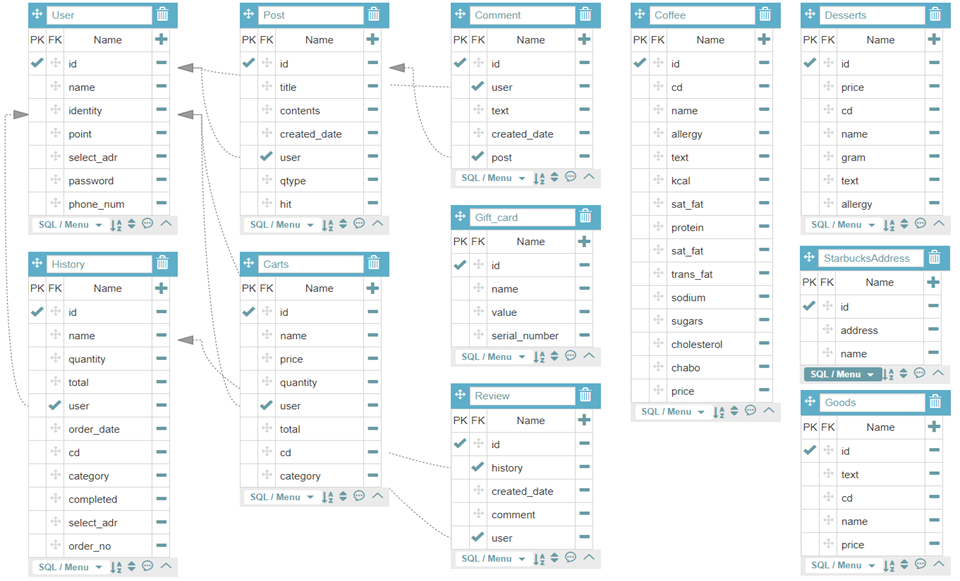

#### 시연

* 메인페이지

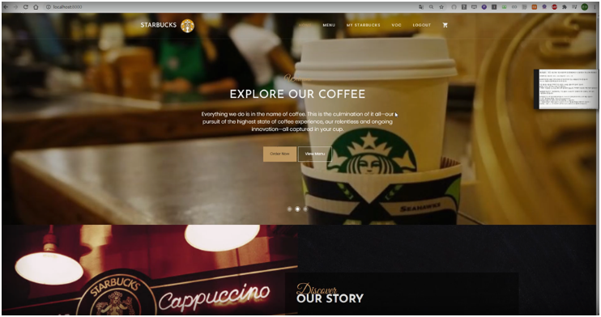

* Navigator

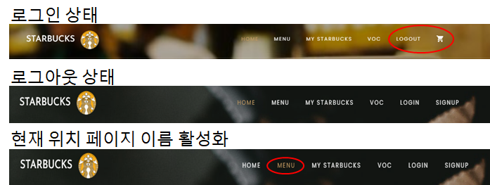

* 회원가입

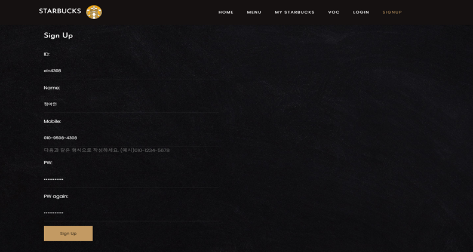

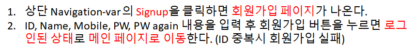

* 로그인/로그아웃

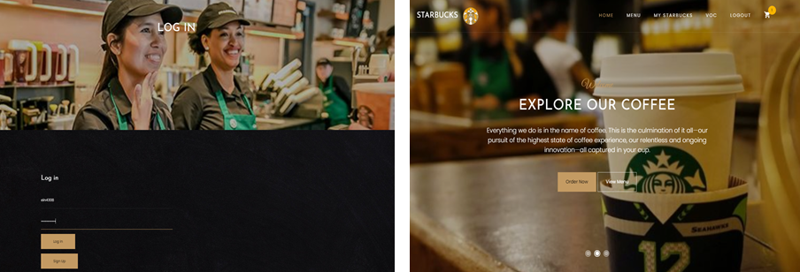

* 메뉴

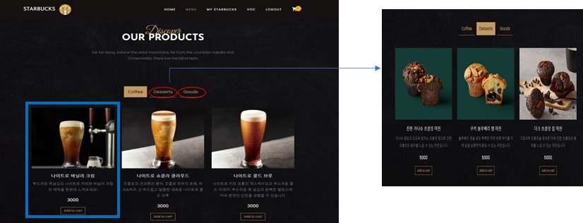

* 제품 상세보기

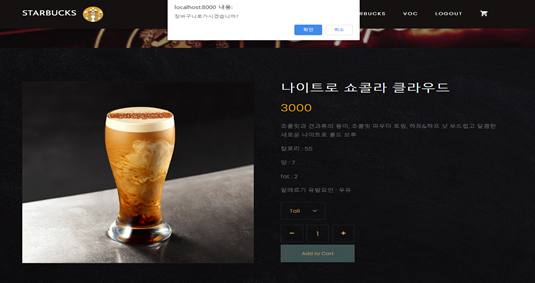

* 장바구니

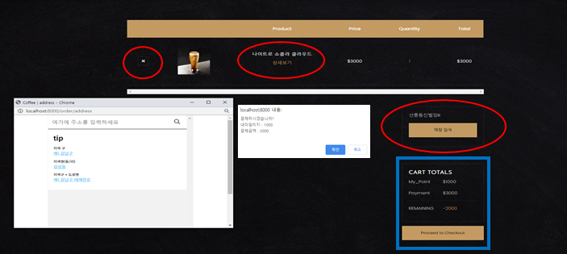

* 주소찾기

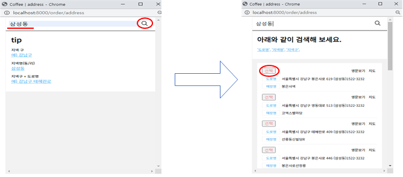

* 마이페이지

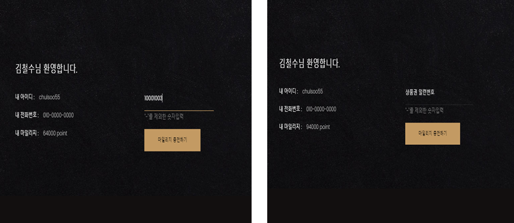

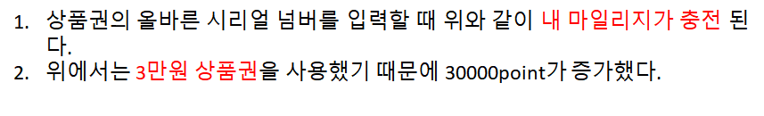

* 주문내역

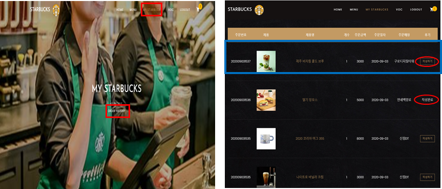

* 리뷰작성

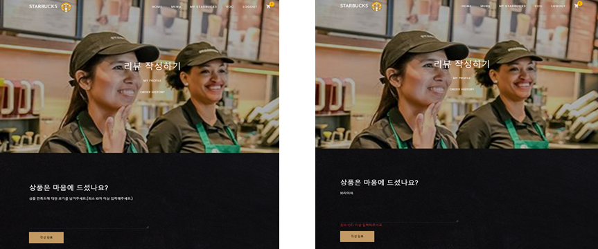

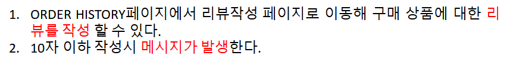

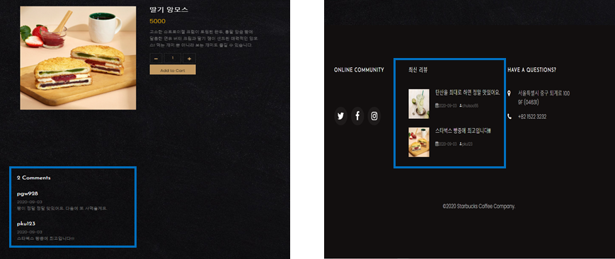

* VOC BBS

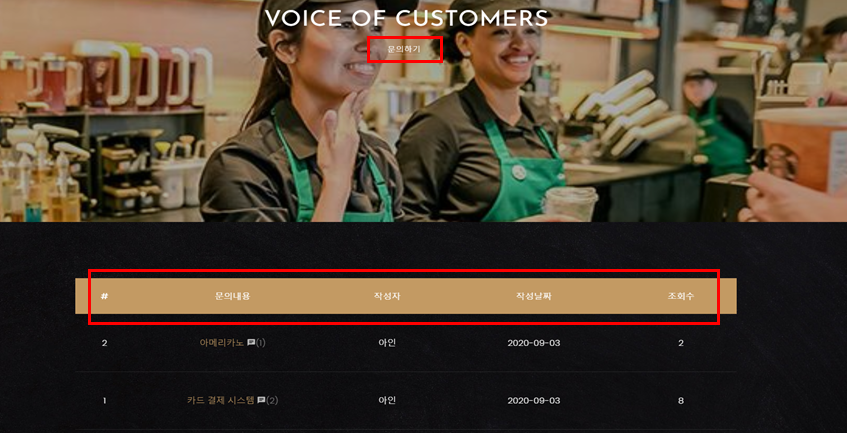

* VOC POSTING

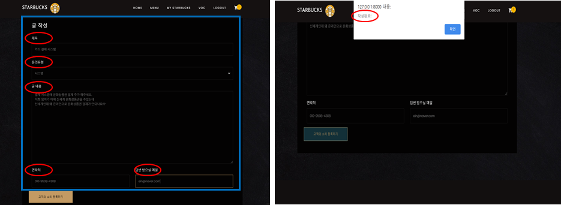

* VOC DETATIL

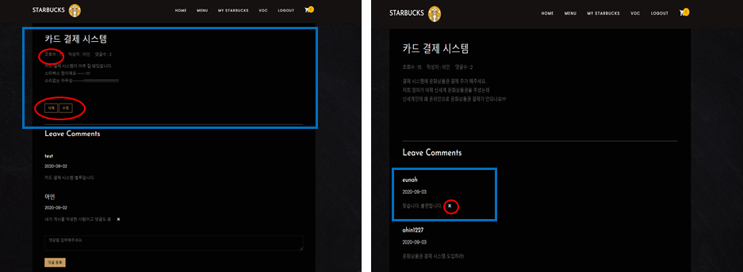

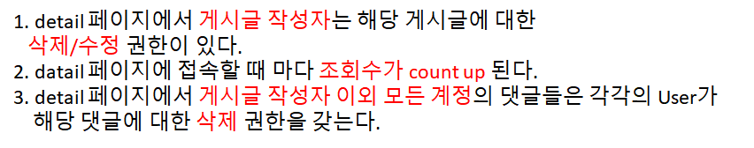